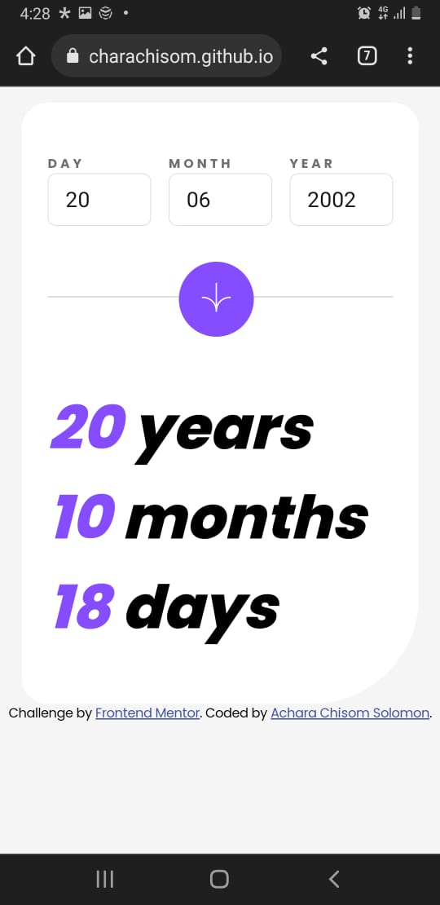

# Frontend Mentor - Age calculator app

# Frontend Mentor - Age calculator app solution

This is a solution to the [Age calculator app challenge on Frontend Mentor](https://www.frontendmentor.io/challenges/age-calculator-app-dF9DFFpj-Q). Frontend Mentor challenges help you improve your coding skills by building realistic projects.

## Overview

### The challenge

Users should be able to:

- View an age in years, months, and days after submitting a valid date through the form
- Receive validation errors if:
  - Any field is empty when the form is submitted
  - The day number is not between 1-31
  - The month number is not between 1-12
  - The year is in the future
  - The date is invalid e.g. 31/04/1991 (there are 30 days in April)
- View the optimal layout for the interface depending on their device's screen size
- See hover and focus states for all interactive elements on the page

### Screenshot

### Links

- Solution URL: [https://github.com/AcharaChisom/age_calculator](https://github.com/AcharaChisom/age_calculator)
- Live Site URL: [https://acharachisom.github.io/age_calculator/](https://acharachisom.github.io/age_calculator/)

## My process

### Built with

- Semantic HTML5 markup
- CSS custom properties
- Flexbox
- Javascript
- Mobile-first workflow

### What I learned

Basicall an opportunity to practice DOM manipulation.

### Continued development

Will have to practice the DRY principle more and take a deeper look at DOM manipulation.

## Author

- Website - [Achara Chisom Solomon](https://acharachisom.github.io/my-portfolio/)
- Frontend Mentor - [@AcharaChisom](https://www.frontendmentor.io/profile/AcharaChisom)
- Twitter - [@Chisom14Solomon](https://twitter.com/Chisom14Solomon)
